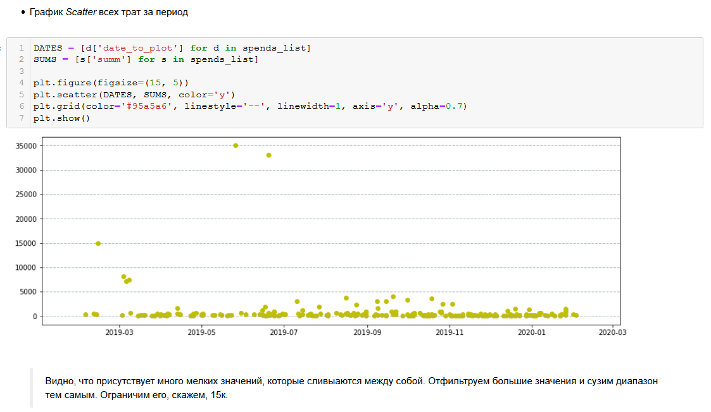
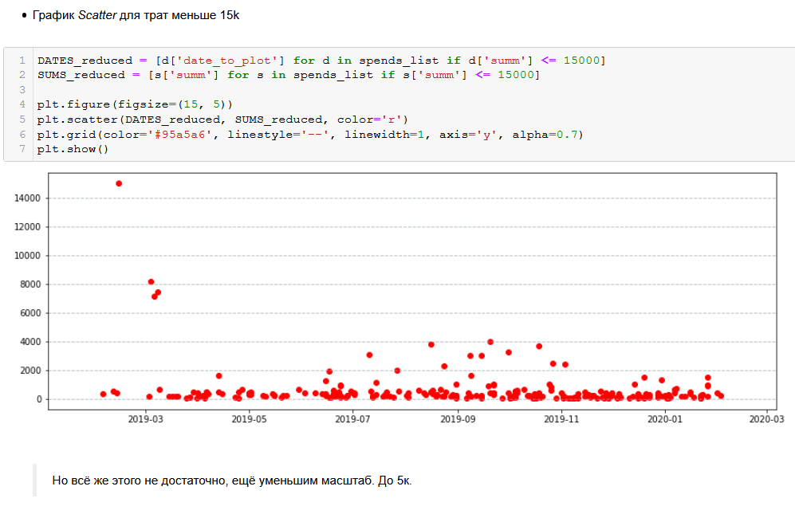
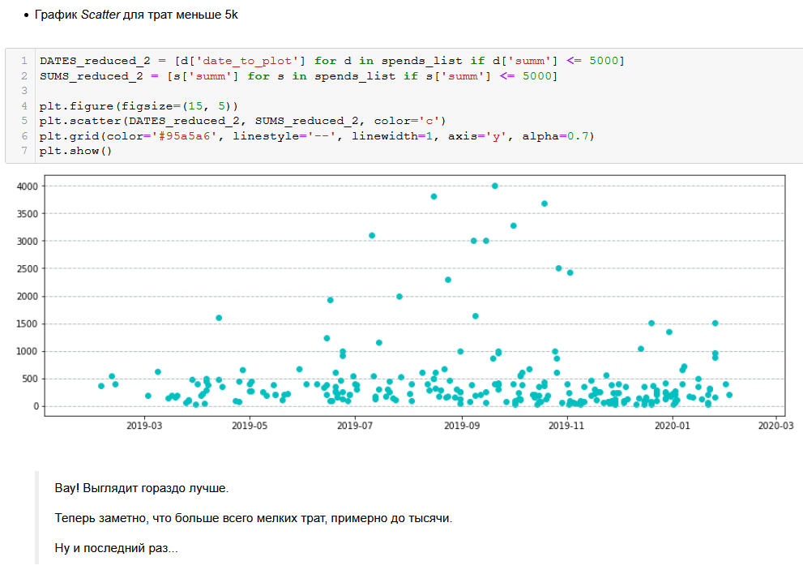
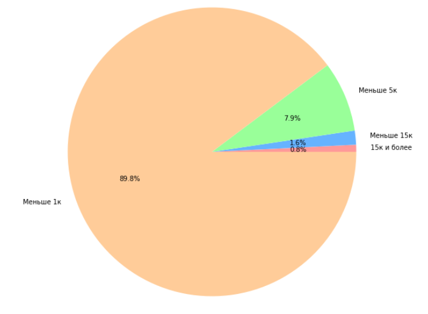
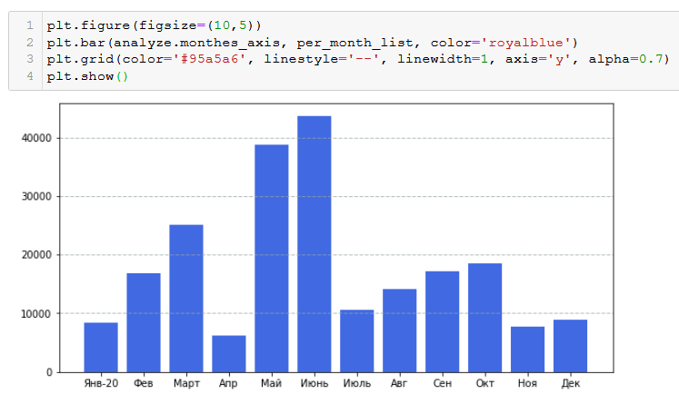
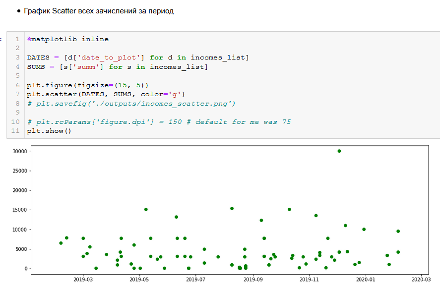
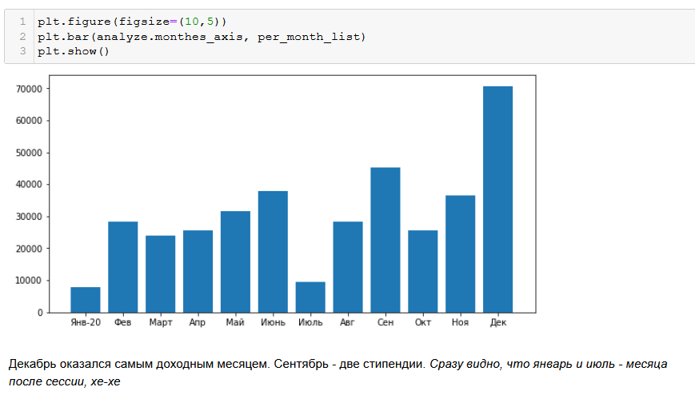

### Простое приложение для анализа расходов и зачислений
###### за период с 4.02.2019 по 5.02.2020

#### Глава 1. Расходы

####  Глава 2. Доходы 

#### Подсказка по маркдауну
https://github.com/adam-p/markdown-here/wiki/Markdown-Cheatsheet

#### How to change jupyter working directory:
https://stackoverflow.com/questions/15680463/change-ipython-jupyter-notebook-working-directory

For Windows it is: `jupyter notebook --notebook-dir=d:\pycharmprojects`

#### How to change matplotlib figsize in jupyter Notebook

[Link] ("https://matplotlib.org/3.1.3/api/_as_gen/matplotlib.pyplot.figure.html")

    import matplotlib as mpl
    import matplotlib.pyplot as plt

- Обращаемся к свойству объекта plt:

    plt.figure(figsize=(15, 5))
    plt.scatter(DATES, SUMS, color='y')
    plt.grid(color='#95a5a6', linestyle='--', linewidth=1, axis='y', alpha=0.7)
    plt.show()

- Обращаемся к свойству объекта matplotlib:

    mpl.rcParams['figure.figsize'] = (15,5)
    plt.rcParams['figure.dpi'] = 150 # default for me was 75
    
###### Ахтунг! Сначала plt.figure(figsize=(15, 5)), затем   plt.scatter или plt.bar, что угодно

#### To do:

* <del>Посчитай, сколько всего стипендии за год получил</del>

* <del>Посчитай доходы и расходы за каждый месяц (также, как в диаграмме Сбера)</del>

* <del>Посчитай, сколько всего переводов от физ. лиц ты получил на карту</del>
* <del>Посчитай, сколько всего зар. платы за год вышло (включая командировочные и отпускные, не забудь)</del>

0. Проанализируй самые большие траты по суммам. К каким категориям они относятся?
0. По графику очевидно, что максимальный доход был 30к за раз, перевод от физ. лица.